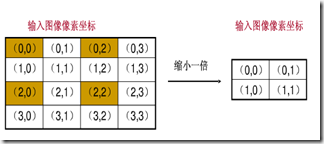

[参考git](https://github.com/2209520576/Image-Processing-Algorithm)

# 图像的几何变换,平移、镜像、缩放、旋转

## 预备知识

主要是前向映射与后向映射，插值，齐次坐标等；齐次坐标单独放在单应性的markdown里。

### 前向映射与后向映射

[参考1](https://www.cnblogs.com/wangguchangqing/p/4039095.html)

图像的几何变换改变了像素的空间位置，建立一种原图像像素与变换后图像像素之间的映射关系，通过这种映射关系能够实现下面两种计算：

1.原图像任意像素计算该像素在变换后图像的坐标位置

2.变换后图像的任意像素在原图像的坐标位置

对于第一种计算，只要给出原图像上的任意像素坐标，都能通过对应的映射关系获得到该像素在变换后图像的坐标位置。将这种输入图像坐标映射到输出的过程称为“**向前映射**”。反过来，知道任意变换后图像上的像素坐标，计算其在原图像的像素坐标，将输出图像映射到输入的过程称为“**向后映射**”。但是，在使用向前映射处理几何变换时却有一些不足，通常会产生两个问题：映射不完全，映射重叠

1.映射不完全

输入图像的像素总数小于输出图像，这样输出图像中的一些像素找不到在原图像中的映射

2.映射重叠

根据映射关系，输入图像的多个像素映射到输出图像的同一个像素上。

要解决上述两个问题可以使用“**向后映射**”，使用输出图像的坐标反过来推算改坐标对应于原图像中的坐标位置。这样，输出图像的每个像素都可以通过映射关系在原图像找到唯一对应的像素，而不会出现映射不完全和映射重叠。所以，一般使用向后映射来处理图像的几何变换。从上面也可以看出，向前映射之所以会出现问题，主要是由于图像像素的总数发生了变化，也就是图像的大小改变了。在一些图像大小不会发生变化的变换中，向前映射还是很有效的。

考虑向前映射碰到问题1时，假设$x_0,y_0$是原图像上像素坐标，$x,y$是变换之后的像素坐标，那么$x = Ux_0,y = Vy_0$进行向前映射，映射不完全时，原来的坐标点只有四个点，但需要的输出结果是16个点，少了12个点无法计算；同理，映射重叠问题就会出现一部分点被重复计算。

考虑向后映射时如何解决这两个问题的，以问题2为例，假设$x_0,y_0$是原图像上像素坐标，$x,y$是变换之后的像素坐标，那么$x_0 = U'x,y_0 = V'y$进行向后映射。个人理解是先计算出变换后的结果图行数列数，得到结果图的坐标信息，那么结果图的像素坐标定下了就去反推每一点坐标与原图坐标的关系。那么映射重叠问题就得到解决，反推回去只会得到一个点，并不会对应多个点。

